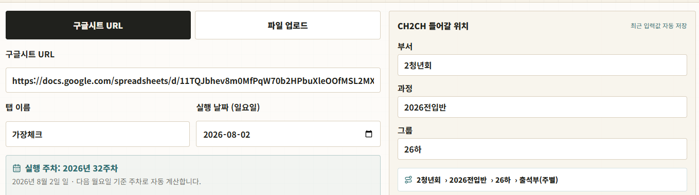

# CH2CH 출석체크 대시보드

> 구글시트 또는 파일에서 출석 대상을 불러오고, 가족별 출석 예약을 조정한 뒤 CH2CH 출석체크 실행을 준비하는 대시보드입니다.

<p align="center">
  <a href="https://ch2ch-attendance-dashboard.vercel.app/runs/new"></a>
  
  
  
</p>

<p align="center"><a href="https://ch2ch-attendance-dashboard.vercel.app/runs/new"><strong>🔗 출석체크 화면 바로가기</strong></a></p>



## 주요 기능

| 기능 | 무엇을 할 수 있나요? |
| --- | --- |
| 📄 출석 대상 불러오기 | Google Sheets URL, CSV, XLSX, XLS, PDF에서 가족과 구성원을 읽습니다. |
| 👨‍👩‍👧 가족별 예약 조정 | 가족별 주일·부서 출석을 시트 원본, 체크 예약, 해제 예약으로 조정합니다. |
| 🔎 검색·필터 | 가족명이나 이름을 검색하고, 실행 대상이 있는 가족만 볼 수 있습니다. |
| 📅 일요일 주차 계산 | 실행 날짜를 일요일로 입력하면 실제 연도·주차와 날짜를 자동 표시합니다. |
| 🧭 CH2CH 경로 입력 | 부서·과정·그룹을 직접 입력하고 출석부 경로를 확인합니다. |
| 💾 최근 입력값 저장 | URL, 탭, 날짜, 경로 값을 브라우저에 저장해 다음 실행의 기본값으로 복원합니다. |
| 🔄 실행 큐·결과 저장 | Vercel이 Supabase에 요청을 등록하고 로컬 Runner가 실제 CH2CH 처리를 수행합니다. |

## 사용 방법

### Windows 앱으로 실행

설치형 앱을 만들려면 프로젝트 폴더에서 다음을 실행합니다.

```powershell
npm install
npm run install-browsers
npm run desktop:dist
```

`dist/`의 `CH2CH 출석체크 Setup.exe`를 설치하면 바탕화면 아이콘으로 Dashboard와 Runner를 함께 실행할 수 있습니다. 설치 후 `.env.local`은 별도로 준비해야 하며, 앱을 종료하면 앱이 시작한 로컬 프로세스도 함께 종료합니다.

### 1. 입력 자료 선택

1. **구글시트 URL** 또는 **파일 업로드**를 선택합니다.
2. 구글시트 URL은 새 사용자에게 빈칸으로 시작합니다.
3. 탭 이름을 입력합니다. 기본값은 `가장체크`입니다.
4. 파일 방식은 `.csv`, `.xlsx`, `.xls`, `.pdf`를 지원합니다.

### 2. 실행 날짜와 CH2CH 위치 입력

1. 실행 날짜는 일요일로 입력합니다.
2. 화면에 `YYYY년 NN주차`와 실제 날짜가 함께 표시됩니다.
3. 부서·과정·그룹을 입력하면 다음 경로로 표시됩니다.

```txt
2청년회 › 2026전입반 › 26하 › 출석부(주별)
```

입력한 값은 브라우저의 최근 설정으로 저장됩니다. 파일 자체는 보안상 저장하지 않습니다.

### 3. 출석 대상 불러오기

**시트/파일에서 가족 불러오기**를 누르면 전체 가족과 구성원이 표시됩니다. 읽기 경고가 있으면 경고 영역에서 확인할 수 있습니다.

### 4. 가족별 실행 예약 조정

가족 카드에서 주일과 부서를 각각 다음 중 하나로 선택합니다.

- **시트 원본**: 원본 출석 표시 유지
- **체크 예약**: 해당 예배 출석 대상으로 지정
- **해제 예약**: 해당 예배 대상에서 제외

상단의 전체 설정 버튼으로 모든 가족을 한 번에 원본 또는 해제 상태로 바꿀 수도 있습니다.

### 5. 실제 실행

예약 인원과 주일·부서별 집계를 확인한 뒤 **실제 출석체크 시작**을 선택합니다. 요청과 진행 상태, 처리 결과는 Supabase에 저장되며 로컬 Runner가 CH2CH 저장을 수행합니다.

## 화면 구성

| 영역 | 역할 |
| --- | --- |
| 입력 패널 | 데이터 소스, 탭, 일요일 날짜 입력 |
| CH2CH 위치 | 부서·과정·그룹과 출석부 경로 입력 |
| 실행 옵션 | 대상 불러오기, 실제 출석체크 실행 |
| 실행 예약 조정 | 가족별 모드, 검색, 대상 필터, 인원 집계 |

## 기술 스택

- **Frontend**: Next.js, React, TypeScript, Tailwind CSS
- **입력 파서**: CSV, XLSX/XLS, PDF 파서
- **아이콘**: lucide-react
- **배포**: Vercel
- **저장 방식**: 브라우저 localStorage + Supabase 실행 큐/결과 저장

## 프로젝트 구조

```txt
.
├── app/
│   ├── api/source-people/   # 시트·파일 출석 대상 파싱 API
│   ├── api/runs/            # Supabase 실행 큐·결과 API
│   └── runs/new/            # 실행 생성 화면
├── components/
│   └── run-create-form.tsx  # 입력·가족별 예약 조정 UI
├── lib/
│   ├── attendance-input-parser.ts
│   └── supabase/            # 서버·브라우저 Supabase 클라이언트
├── runner/                  # 로컬 CH2CH 실행기
├── supabase/                # 스키마와 마이그레이션
└── public/screenshots/      # README 화면 캡처
```

## 로컬 실행

Node.js 20 이상이 필요합니다.

```bash
npm install
npm run dev
npm run runner
```

Windows에서는 `Start-CH2CH.cmd`를 실행하면 대시보드와 Runner가 함께 시작됩니다. 환경변수는 `.env.example`을 참고해 `.env.local`에 입력하고, Supabase SQL Editor에서 `supabase/schema.sql`을 먼저 실행해야 합니다.

브라우저에서 [http://localhost:3000/runs/new](http://localhost:3000/runs/new)을 엽니다.

검증 명령:

```bash
npm run typecheck
npm run build
```

## 데이터 및 보안

- 실행 요청, 처리 로그와 결과는 Supabase에 저장합니다.
- Supabase `service_role` 키와 CH2CH 계정은 공개 저장소에 올리지 않고 Vercel 또는 로컬 `.env.local`에만 보관합니다.
- Google Sheets는 사용자가 입력한 URL을 읽을 때만 요청합니다.
- 최근 폼 설정만 브라우저 `localStorage`에 저장합니다.
- 업로드 입력은 비공개 Supabase Storage 버킷에 저장되며 Runner만 서비스 키로 읽습니다.

## Live

[https://ch2ch-attendance-dashboard.vercel.app/runs/new](https://ch2ch-attendance-dashboard.vercel.app/runs/new)

## 작업 이어가기

다른 PC에서 현재 상태를 확인하고 작업을 이어갈 때는 [인수인계 문서](./docs/CONTINUE-HERE.md)를 먼저 읽으세요.
